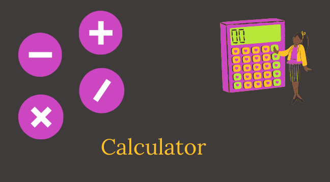

# CALCULADORA

## Práctica integradora
Vamos a programar una calculadora sencilla con los conocimientos que hemos adquirido
hasta el momento. La calculadora contará con 4 funciones básicas:
 - Sumar
 - Restar
 - Multiplicar
 - Dividir

## M2 C4

## Clase 8

## Ubicación -> Programación/TRABAJOS PRACTICOS/Calculadora